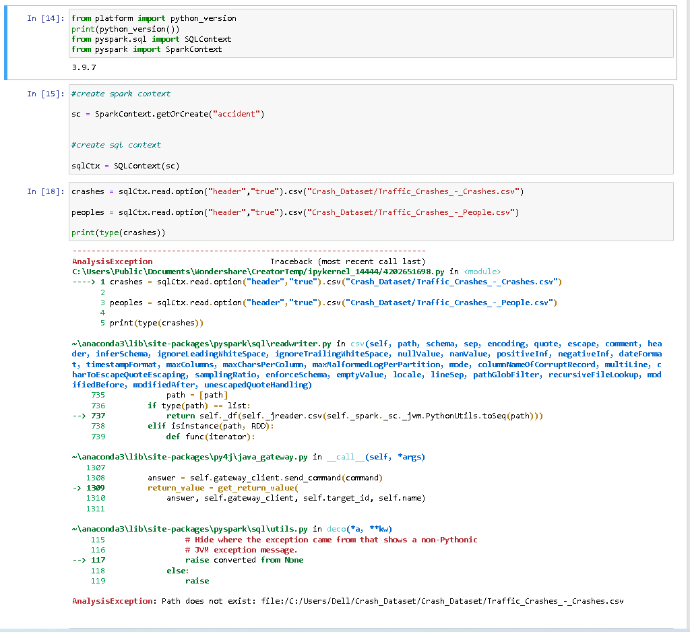
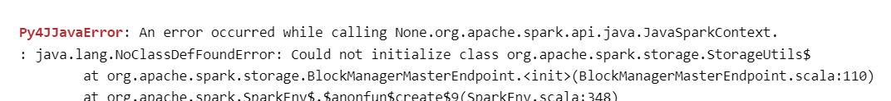

# Path Does not Exist Error

### This issue can occur if any of the following scenarios exist on your PC.

- You do not have permissions to the file or the file location.
- The file is on a location that is not currently accessible like a network location or an external drive that is not currently connected to the PC.
- The file has been moved or deleted.
- The file or shortcut is corrupt.
- The file may be blocked by Windows.
- Your antivirus software may be blocking the file.

  

# Py4JJavaError

### This issue can occur if any of the following scenarios exist:
-1 You do not hava instaled the Java JDK
-2 The Java JDK in not in your Environment Path
-3 The pyspark version is old
-4 restart the jupyter lab kernel if none of the above mentioned. 
-5 PYSPARK_PYTHON variable not defind in environment

